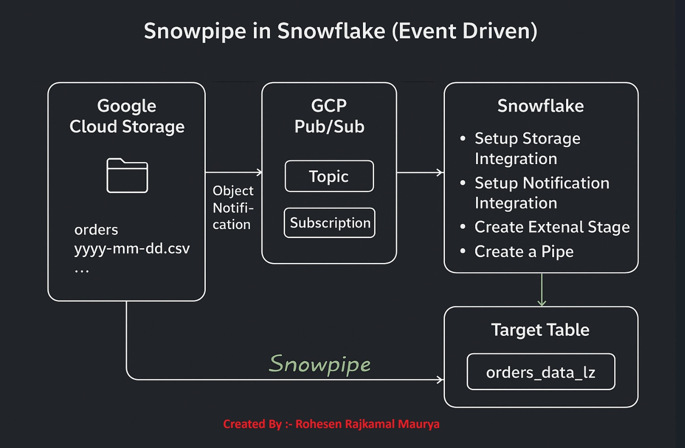

# 📌 Snowpipe in Snowflake❄️ (Event-Driven Ingestion)

This project demonstrates how to build an **event-driven data ingestion pipeline** from **Google Cloud Storage (GCS)** to **Snowflake** using **Snowpipe** and **Google Pub/Sub**.

The pipeline automatically loads new files dropped into a GCS bucket into a Snowflake target table — without manual triggers.




---
## ⚙️ Flow

1. **Upload Files to GCS**

   * Raw CSV files (e.g., `orders_20231210.csv`) are uploaded into a GCS bucket.

2. **Object Notifications**

   * GCS is configured to send **object create events** to a **Pub/Sub topic** whenever a new file is uploaded.

3. **Pub/Sub → Snowflake**

   * A **subscription** is created on the topic.
   * Snowflake is connected to this subscription via a **Notification Integration**.
   * Proper IAM permissions are granted so Snowflake’s service account can pull messages.

4. **Storage Integration**

   * Snowflake uses a **Storage Integration** to securely access the GCS bucket.
   * This integration is mapped to a service account in GCP with `storage.objectViewer` permissions.

5. **External Stage**

   * An **External Stage** in Snowflake points to the GCS bucket path.

6. **Snowpipe**

   * Snowpipe is configured on the stage with:

     * File format definition (CSV, no header, delimiter `,`).
     * Notification integration (linked to Pub/Sub).
   * It listens for new file notifications.

7. **Automatic Data Load**

   * When a file arrives:

     * GCS emits event → Pub/Sub → Snowflake Notification Integration.
     * Snowpipe auto-runs a `COPY INTO` command.
     * Data lands in the **target table** (`ORDERS_DATA_LZ`).

---

## 🔑 Components

* **Google Cloud Storage (GCS)** → Raw file storage.
* **Pub/Sub** → Event bus for file notifications.
* **Snowflake Storage Integration** → Secure bucket access.
* **Snowflake Notification Integration** → Connects Pub/Sub subscription to Snowflake.
* **External Stage** → Reference to GCS bucket inside Snowflake.
* **Snowpipe** → Handles event-driven ingestion.
* **Target Table** → Final landing zone in Snowflake.

---

## 🛠️ Setup Steps with Explanation

### 1. Create Database and Table

We start by creating a database and a table where ingested data will land.

```sql
use role accountadmin;

create or replace database snowpipe_demo;

create or replace table orders_data_lz(
    order_id int,
    product varchar(20),
    quantity int,
    order_status varchar(30),
    order_date date
);
```

👉 **Why?** This is the destination table where Snowpipe will insert rows from the CSV files.

---

### 2. Configure GCS Storage Integration

```sql
create or replace storage integration gcs_bucket_read_int
  type = external_stage
  storage_provider = gcs
  enabled = true
  storage_allowed_locations = ('gcs://data_for_snowpipe12/');
```

Then describe it:

```sql
desc storage integration gcs_bucket_read_int;
```

👉 **Why?** This creates a secure connection between Snowflake and GCS. Snowflake gives us a **service account** to grant permissions on the GCS bucket.

---

### 3. Create Stage in Snowflake

```sql
create or replace stage snowpipe_stage
  url = 'gcs://data_for_snowpipe12/'
  storage_integration = gcs_bucket_read_int;
```

👉 **Why?** A stage is a pointer to your GCS bucket. It’s how Snowflake knows where to look for files.
You can test with:

```sql
list @snowpipe_stage;
```

---

### 4. Setup GCS → Pub/Sub Notification

Enable bucket notifications:

```bash
gsutil notification create -t snowpipe_pubsub_topic-sub -f json gs://data_for_snowpipe12/
```

Create a subscription:

```bash
gcloud pubsub subscriptions create snowpipe_pubsub_topic-sub-sub \
  --topic=snowpipe_pubsub_topic-sub
```

Grant Snowflake’s service account access:

```bash
gcloud pubsub subscriptions add-iam-policy-binding snowpipe_pubsub_topic-sub-sub \
  --member="serviceAccount:<Snowflake_Service_Account>" \
  --role="roles/pubsub.subscriber"
```

👉 **Why?**
When a file is uploaded to GCS, an event is published to Pub/Sub.
The subscription ensures Snowflake gets those events in real-time.

---

### 5. Create Notification Integration in Snowflake

```sql
create or replace notification integration notification_from_pubsub_int
  type = queue
  notification_provider = gcp_pubsub
  enabled = true
  gcp_pubsub_subscription_name = 'projects/horizontal-data-464415-v6/subscriptions/snowpipe_pubsub_topic-sub-sub';
```

👉 **Why?** This lets Snowflake **listen to Pub/Sub** messages so it knows when to start ingestion.

---

### 6. Create the Snowpipe

```sql
create or replace pipe gcs_to_snowflake_pipe
  auto_ingest = true
  integration = notification_from_pubsub_int
as
copy into orders_data_lz
from @snowpipe_stage
file_format = (type = 'CSV' field_optionally_enclosed_by='"');
```

👉 **Why?** A **pipe** ties everything together:

* Watches the stage for new files
* Uses the notification integration
* Runs `COPY INTO` automatically

---

### 7. Validate the Pipeline

Upload a file:

```bash
gsutil cp orders_20231210.csv gs://data_for_snowpipe12/
```

Check pipe status:

```sql
select system$pipe_status('gcs_to_snowflake_pipe');
```

Check ingestion history:

```sql
select * 
from table(information_schema.copy_history(
  table_name=>'orders_data_lz',
  start_time=>dateadd(hours, -1, current_timestamp())
));
```

Query the table:

```sql
select * from orders_data_lz;
```

👉 **Why?** This confirms that files are being detected and data is being ingested automatically.

---

## ✅ Key Learnings

* **Snowpipe** enables real-time auto-ingestion of files.
* **Storage Integration** is required to securely connect Snowflake to external storage.
* **Pub/Sub notifications** tell Snowflake that new files are ready to be ingested.
* Ingestion is **asynchronous** (may take 1–2 mins).
* `copy_history` and `system$pipe_status` are key for troubleshooting.

---

## 📌 Next Improvements

* Create a **named file format** instead of inline definition:

  ```sql
  create or replace file format csv_file_format
    type = 'CSV'
    field_optionally_enclosed_by='"'
    skip_header=0;
  ```

  Update pipe:

  ```sql
  copy into orders_data_lz
  from @snowpipe_stage
  file_format = csv_file_format;
  ```
* Add monitoring alerts for failed loads.
* Automate setup with Terraform or scripts.
* Add error handling (redirect bad files to error bucket).

